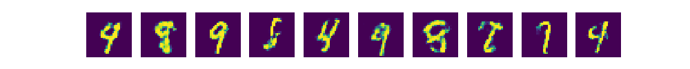

# TensorFlow-vanilla-GAN
Generative Adversarial Network

원하는 Target이 아닌 랜덤한 이미지 생성.

GAN paper : https://papers.nips.cc/paper/5423-generative-adversarial-nets.pdf

## vanilla_gan.py
    * loss function
        * Discriminator : Maximize -> tf.reduce_mean(tf.log(D_X) + tf.log(1-D_Gen))
            * D_X가 1로, D_Gen이 0으로 수렴해야 Maximize가 됨.
            
        * Generator : Maximize -> tf.reduce_mean(tf.log(D_Gen)) 
            * D_Gen이 1로 수렴해야 Maximize가 됨.
            
## vanilla_gan_v2.py
    * loss function
        * Discriminator : Minimize -> tf.reduce_mean(D_X_loss) + tf.reduce_mean(D_Gen_loss)
            * D_X_loss = tf.nn.sigmoid_cross_entropy_with_logits(labels=tf.ones_like(D_X_logits), logits=D_X_logits)
                * D_X가 1로 수렴해야 Maximize가 되므로 D_X와 1과의 오차를 최소화 하도록 학습.
            * D_Gen_loss = tf.nn.sigmoid_cross_entropy_with_logits(labels=tf.zeros_like(D_Gen_logits), logits=D_Gen_logits)
                * D_Gen이 0으로 수렴해야 Maximize가 되므로 D_Gen과 0과의 오차를 최소화 하도록 학습.
                
        * Generator : Minimize -> tf.reduce_mean(G_loss)
            * G_loss = tf.nn.sigmoid_cross_entropy_with_logits(labels=tf.ones_like(D_Gen_logits), logits=D_Gen_logits)
                * D_Gen이 1로 수렴해야 Maximize가 되므로 D_Gen과 1과의 오차를 최소화 하도록 학습.
                
                
  
## vanilla_gan.py result (after 300 epoch)  
  
  
## vanilla_gan_v2.py result (after 300 epoch)  
  
  
